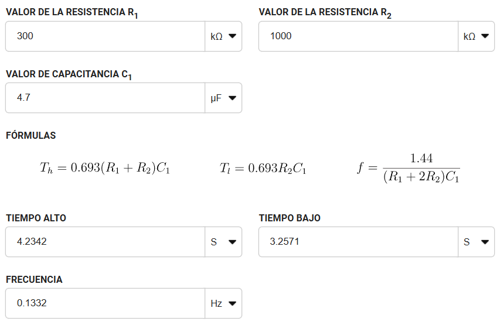
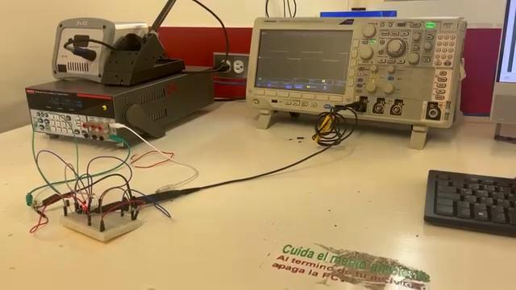

# Practicas realizadas para proyecto

## 1) Práctica 1
Para la primera práctica, se nos dio una pequeña clase de lógica en la electrónica, luego se nos pasó una página para calcularlo, que sería el capacitor y la resistencia para realizar que un led prenda 4 segundos y apague 4 segundos de manera consecutiva.

Los **materiales** que utilizamos fueron:
- 1 compuerta lógica 555, que es un contador
- 1 resistencia de 300 kΩ
- 1 resistencia de 1000 kΩ
- 1 resistencia de 220 Ω
- 1 capacitor de 4.7 µF

La página que se utilizó para calcular las resistencias y el capacitor fue en [Digikey](https://www.digikey.com.mx/es/resources/conversion-calculators/conversion-calculator-555-timer?srsltid=AfmBOorIMn9rovHiLriNQc45qD3LhIHQ_Ve1l8VCfuCqa09MgpDren3H), la cual nos ayudó a determinar el valor de las resistencias y el valor del capacitor, después para saber como conectar, buscamos la [Datasheet](https://www.alldatasheet.com/datasheet-pdf/view/208043/TI/NE555P.html) del contador 555



Después de que se calculara todo, se tuvo que realizar las conexiones a base de todo lo calculado anteriormente. Con esto se tuvo que observar que señales mandaba con el osciloscopio para ver como reaccionaba y se mandaban las señales de encendido y apagado en el circuito que se realizó. 


---

## 2) Práctica 2

Antes de empezar esta práctica, aprendimos que existen diversos tipos de microcontroladores, uno de ellos es el [ESP32](https://www.waveshare.com/img/devkit/accBoard/NodeMCU-32S/NodeMCU-32S-details-3.jpg), el cual es mucho mejor que un Arduino UNO, ya que este tiene conectividad a wifi y a bluetooth incluida.

Después de eso, aprendimos algunas funciones básicas del Arduino, para empezar con la primera práctica. También aprendimos lógica para conectar circuitos, lo cual sería de gran ayuda para la práctica.

Terminando todo eso, empezamos la práctica. Procedimos a conectar el ESP32 a una protoboard y después de eso  realizamos varias conexiones con sus referentes resistencias y también cargamos lo que sería el código de Arduino para el ESP32, el cual es el siguiente:

```c++
#define LED 23
void setup() {
    pinMode(LED, OUTPUT);
}
void loop() {
    digitalWrite(LED, HIGH); 
    delay(1000);
    digitalWrite(LED, LOW); 
    delay(1000);
}
```
El cual el resultado salo algo asi:


Después de eso procedimos a la siguiente parte que era agregarle un botón para que encienda y apague. Para esto, en la parte del código no cambiaría mucho, solo se le necesita definir  la señal de entrada del botón y agregarle una condicional. El código quedaría algo así:

```c++
#define LED 23
#define BUTTON 33

void setup() {
    pinMode(LED, OUTPUT);
    pinMode(BUTTON, INPUT);
}
void loop() {
    if (digitalRead(BUTTON) == HIGH) {
        digitalWrite(LED, HIGH);
    } else {
        digitalWrite(LED, LOW);
    }
}
```

Y el circuito se veria algo asi:


Por siguiente, se nos explicó como conectar el ESP32 por Bluetooth y como controlarlo, esto se basa por medio de una aplicación, la cual se llama [Serial Bluetooth Terminal](https://play.google.com/store/apps/details?id=de.kai_morich.serial_bluetooth_terminal&hl=es), el cual manda señales, las cuales las recibe el ESP32 y con estas señales se puede realizar lo anteriormente realizado, pero con la aplicación, así que el código cambiaria para recibir señales Bluetooth:
```c++
#include "BluetoothSerial.h"
BluetoothSerial SerialBT;

#define LED 23

void setup() {
    Serial.begin(115200);
    SerialBT.begin("ESP32");
    pinMode(LED, OUTPUT);
}

void loop() {
    if (SerialBT.available()) {
        String mensaje = SerialBT.readString();
        Serial.println("Recibido: " + mensaje);
        if (mensaje == "prendido") {
            digitalWrite(LED, HIGH);
        } else if (mensaje == "apagado") {
            digitalWrite(LED, LOW);
        }
    }
    delay(1000);
}
```
El circuito se vería algo así:


---
## 3) Práctica 3

En esta práctica se recuperó lo visto con anterioridad y se verán más temas sobre como el [Puente H](https://europe1.discourse-cdn.com/arduino/original/4X/2/5/3/253f56d944d1e7b663778a00035cd1620a1a2b0f.jpeg), el cual ayuda a aumentar y regular el voltaje, junto con el amperaje. Esto será, necesario para poder mover los motores a una velocidad considerable.

En el código se van a agregar salidas que serán las IN1,IN2,IN3,IN4 y las señales que se mandarán para las salidas de cada una. El código se vería algo así:

```c++
#define in1 32
#define in2 33

void setup() {
  pinMode(in1, OUTPUT);
  pinMode(in2, OUTPUT);
}

void loop() {

  digitalWrite(in1, 0);
  digitalWrite(in2, 1);
  delay(1000);
 
  digitalWrite(in1, 0);
  digitalWrite(in2, 0);
  delay(1000);
 
  digitalWrite(in1, 1);
  digitalWrite(in2, 0);
  delay(1000);

  digitalWrite(in1, 0);
  digitalWrite(in2, 0);
  delay(1000);
}
```
Después de hacer que avanzaran los motores, se solicitó hacer que se movieran a una velocidad. Se tendría que agregar otra nueva señal para que sea la de velocidad, esto también lo puede realizar con el puente H, así que el código se vería así:

```c++
#define in1 32
#define in2 33
#define pwm 25

void setup() {

  pinMode(in1, OUTPUT);
  pinMode(in2, OUTPUT);
  ledcAttachChannel(pwm, 1000, 8, 0);
}

void loop() {
  digitalWrite(in1, 0);
  digitalWrite(in2, 1);
  ledcWrite(pwm, 0);
  delay(500);
  ledcWrite(pwm, 51);
  delay(500);
  ledcWrite(pwm, 102);
  delay(500);
  ledcWrite(pwm, 153);
  delay(500);
  ledcWrite(pwm, 204);
  delay(500);
  ledcWrite(pwm, 255);
  delay(500);
}
```
Y las conexiones del Puente H se verán algo parecido como lo muestra la imagen:


Como no importa la polaridad en los motores, se puede conectar de cualquier lado, solo cambiaría en qué dirección se dirige el motor.

---

## 4) Práctica 4
En la cuarta práctica se vieron el tema de servos, aunque nuestra clase fue la única que se atrasó con ese tema, logramos comprender el funcionamiento del servo, de una manera un poco más y menos práctica. Con todo esto, vimos como se conecta y como se programa en el ESP32 para que así se mande un ángulo y se mueva en ese ángulo, pero con una ligera restricción el servomotor solo puede girar 180°. El código se vería algo así:

```c++
#define pwm 12
int duty = 0;
int grados = 0;

void setup() {
  pinMode(in1, OUTPUT);
  pinMode(in2, OUTPUT);
  ledcAttachChannel(pwm, 50, 12, 0);
  Serial.begin(115200);
}

void loop() { 
  grados=0;
  duty= map(grados, 0, 180, 205, 410);
  Serial.print("Pos: ");
  Serial.println(duty);
  ledcWrite(pwm, duty);
  delay(1000);
  grados=90;
  duty= map(grados, 0, 180, 205, 410);
  Serial.print("Pos: ");
  Serial.println(duty);
  ledcWrite(pwm, duty);
  delay(1000);
  grados=180;
  duty= map(grados, 0, 180, 205, 410);
  Serial.print("Pos: ");
  Serial.println(duty);
  ledcWrite(pwm, duty);
  delay(1000);
}
```
La función Map, nos ayuda a evitar hacer cálculos para mover en el ángulo que queremos, así que la función lo hace directamente, para mandar la señal al servo y este se moverá el ángulo que fue solicitado.

---
## 5) Práctica 5 

En esta práctica se nos dijo que se tiene que hacer un carrito para que compita con otros en fútbol, así que el grupo se decidió dividir en diferentes grupos, unos que hagan la parte de construccion. 
En mi caso, me dediqué a hacer parte de la programación y apoyar en el armado. En la parte de programación me dediqué a realizar el movimiento de los servos y una aplicación de móvil, junto a otros de mis compañeros.

Lo primero que se realizó para el servo, fue hacer que se moviera con la aplicación que nos se había mencionado anteriormente. Esto hacía que se moviera hasta ciertos ángulos en específico, pero no dejaba mover libremente el servo. El código quedó de la siguiente manera.

```c++
#include "BluetoothSerial.h"
BluetoothSerial SerialBT;
#define servo1 32
int derecha=0;
int centro=0;
int izquierda=0;
void setup() {
  // put your setup code here, to run once:
  ledcAttachChannel(servo1, 50 ,8,0);
  SerialBT.begin("Pancracio");
  Serial.begin(115200);
}
 
void loop() {
  // put your main code here, to run repeatedly:
  if(SerialBT.available()){
    String mensaje = SerialBT.readString();
        Serial.println("Recibido: " + mensaje);
        if (mensaje=="1"){
          derecha=map(35,0,180,13,26);
          ledcWrite(servo1, derecha);
        }
        else if (mensaje=="2"){
          centro=map(90,0,180,13,26);
          ledcWrite(servo1, centro);
        }
        else if (mensaje=="3"){
          izquierda=map(145,0,180,13,26);
          ledcWrite(servo1, izquierda);
        }
 
  }
  delay(1000);
}
```
Lo que se quiso realizar con este código fue, que cuando se mandara un numero del 1 al 3, se moviera cierto grado que fue definido con anterioridad. Asi se podria mover una garra para controlar mejor la pelota. Mientras tanto otro equipo se encargaba de hacer lo mismo pero con los motores de las llantas

Como al grupo se le hizo incomodo mover los motores y el servo con la aplicación que se nos había dado con anterioridad. Decidimos buscar una que nos ayudara a mover todo libremente, pero surgieron varios problemas así que se tomo la decision de hacer una aplicacion en [MIT APP INVENTOR](https://appinventor.mit.edu/), esta decision nos quito problemas que habian surgido con anterioridad. 

El nuevo problema que surgio fue que no sabiamos como usar el programa, así que tardo un poco más de lo esperado pero al final el programa para crear la aplicacion y la aplicacion salio así:


Ya con el código final de la aplicación, se tuvo que corregir el código para adaptarlo a la aplicacion y de ahi se tiene que agregar la parte del código de los motores de las llantas. Así que el código se veria algo así:

```c++
#include "BluetoothSerial.h"
BluetoothSerial SerialBT;

#define SERVO_PIN 32
#define pwm 26 
#define in1 33
#define in2 25
#define in3 27
#define in4 14

int angulo = 90;
int nuevoAngulo = 0;
void setup() {
  Serial.begin(115200);
  SerialBT.begin("Pancracio2");
  Serial.println("Esperando conexión Bluetooth...");
  ledcAttach(SERVO_PIN, 50, 8); 
  pinMode(in1, OUTPUT);
  pinMode(in2, OUTPUT);
  pinMode(in3, OUTPUT);
  pinMode(in4, OUTPUT);
  moverServo(angulo); 
}

void loop() {
  if (SerialBT.available()) {
    int msj= SerialBT.read();
    
    Serial.println(msj);
    if(msj>=0 && msj<=180){
      moverServo(msj);
      }else if(msj == 182){ 
        digitalWrite(in1,1);
        digitalWrite(in2,0);
        digitalWrite(in3,1);
        digitalWrite(in4,0);
 
      }else if(msj == 183){
        digitalWrite(in1,0);
        digitalWrite(in2,1);
        digitalWrite(in3,0);
        digitalWrite(in4,1);

      }else if(msj == 184){
        digitalWrite(in1,1);
        digitalWrite(in2,0);
        digitalWrite(in3,0);
        digitalWrite(in4,1);

      }else if(msj == 185){
        digitalWrite(in1,0);
        digitalWrite(in2,1);
        digitalWrite(in3,1);
        digitalWrite(in4,0);

      }else if(msj == 186){
        digitalWrite(in1,0);
        digitalWrite(in2,0);
        digitalWrite(in3,0);
        digitalWrite(in4,0);
      }
  }
  }
void moverServo(int angulo) {
  int duty = map(angulo, 0, 180, 13, 26);  // Ajusta si el servo no recorre bien
  ledcWrite(SERVO_PIN, duty);
}
```

Con el codigo ya terminado, se tuvieron que realizar las conexiones y armar, así que después de que se prepara todo listo, se estuvo armando por dos dias los tres coches que al final quedaron y aun que lamentablemente quedamos en segundo lugar, fue una gran experiencia armarlo y realizar el codigo junto la aplicación.

